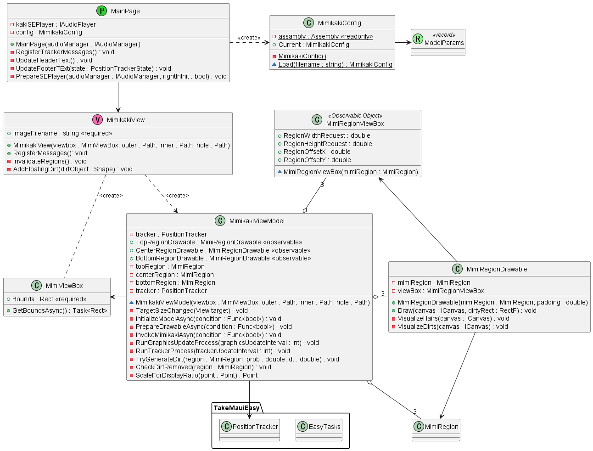
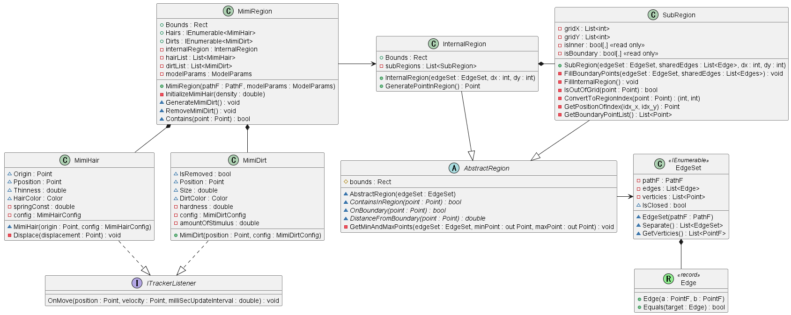
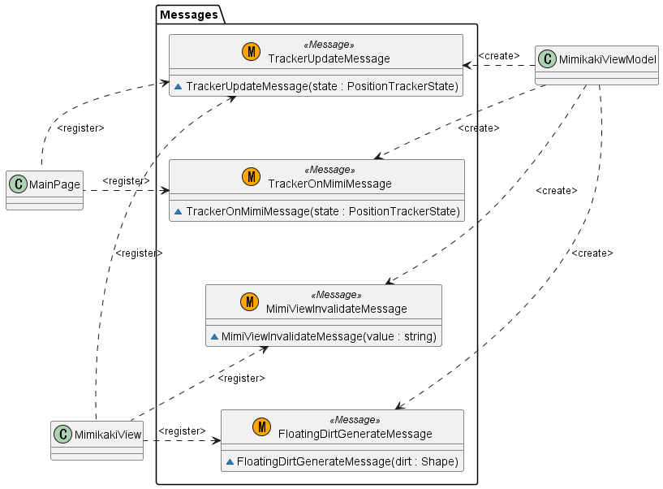

# MauiMimikakiApp

A mimikaki (Ear cleaning) App.

<div>
<video controls src=></video>
</div>

## Files editted

<details>
<summary>Details</summary>

 - MauiMimikakiApp/
     - Configs/
         - [MimikakiConfig.cs](./MauiMimikakiApp/Configs/MimikakiConfig.cs)
         - [ModelParams.cs](./MauiMimikakiApp/Configs/ModelParams.cs)
     - CustomViews/
         - [MimiDirectionSwitch.xaml](./MauiMimikakiApp/CustomViews/MimiDirectionSwitch.xaml)
         - [MimiDirectionSwitch.xaml.cs](./MauiMimikakiApp/CustomViews/MimiDirectionSwitch.xaml.cs)
         - [MimikakiView.xaml](./MauiMimikakiApp/CustomViews/MimikakiView.xaml)
         - [MimikakiView.xaml.cs](./MauiMimikakiApp/CustomViews/MimikakiView.xaml.cs)
     - Drawables/
         - [MimiRegionDrawable.cs](./MauiMimikakiApp/Drawables/MimiRegionDrawable.cs)
         - [MimiRegionViewBox.cs](./MauiMimikakiApp/Drawables/MimiRegionViewBox.cs)
     - Messages/
         - [FloatingDirtGenerateMessage.cs](./MauiMimikakiApp/Messages/FloatingDirtGenerateMessage.cs)
         - [MimiViewInvalidateMessage.cs](./MauiMimikakiApp/Messages/MimiViewInvalidateMessage.cs)
         - [RegionDebugMessage.cs](./MauiMimikakiApp/Messages/RegionDebugMessage.cs)
         - [TrackerOnMimiMessage.cs](./MauiMimikakiApp/Messages/TrackerOnMimiMessage.cs)
         - [TrackerUpdateMessage.cs](./MauiMimikakiApp/Messages/TrackerUpdateMessage.cs)
     - MimiModels/
         - [ITrackerListener.cs](./MauiMimikakiApp/MimiModels/ITrackerListener.cs)
         - [MimiDirt.cs](./MauiMimikakiApp/MimiModels/MimiDirt.cs)
         - [MimiHair.cs](./MauiMimikakiApp/MimiModels/MimiHair.cs)
         - [MimiRegion.cs](./MauiMimikakiApp/MimiModels/MimiRegion.cs)
         - [MimiViewBox.cs](./MauiMimikakiApp/MimiModels/MimiViewBox.cs)
     - RegionModels/
         - [AbstractRegion.cs](./MauiMimikakiApp/RegionModels/AbstractRegion.cs)
         - [EdgeSet.cs](./MauiMimikakiApp/RegionModels/EdgeSet.cs)
         - [InternalRegion.cs](./MauiMimikakiApp/RegionModels/InternalRegion.cs)
         - [SubRegion.cs](./MauiMimikakiApp/RegionModels/SubRegion.cs)
     - Resources/
         - Images/
         - Raw/
     - ViewModels/
         - [MimikakiViewModel.cs](./MauiMimikakiApp/ViewModels/MimikakiViewModel.cs)
     - [MainPage.xaml](./MauiMimikakiApp/MainPage.xaml)
     - [MainPage.xaml.cs](./MauiMimikakiApp/MainPage.xaml.cs)
     - [MauiMimikakiApp.csproj](./MauiMimikakiApp/MauiMimikakiApp.csproj)
     - [MauiProgram.cs](./MauiMimikakiApp/MauiProgram.cs)
 - uml/
     - [MimikakiApp.puml](./uml/MimikakiApp.puml)
</details>

## UML (partial)

<details>
<summary>Class diagram (views)</summary>



</details>

<details>
<summary>Class diagram (models)</summary>



</details>

<details>
<summary>Class diagram (messages)</summary>



</details>

## What I learnt from this project

- How to change VisualState by StateTrigger
- How to do binding with RelativeSouce
- How to use EventToCommandBehavior (toolkit)
- How to use Plugin.Maui.Audio
- How to reference a local library project
- How to create a DTO (data transfer object) using record
- How to deserialize nested JSON data
- How to realize a loosely coupling using Message

<!-- ### Change VisualState depending on a boolean bindable property

```xml
<VisualStateManager.VisualStateGroups>
    <VisualStateGroup Name="EarDirection">
        <VisualState Name="Right">
            <VisualState.StateTriggers>
                <StateTrigger IsActive="{Binding IsRight, Source={x:Reference DirectionSwitch}}"/>
            </VisualState.StateTriggers>
            <VisualState.Setters>
                <Setter TargetName="MimiGrid" Property="RotationY" Value="180"/>                            
            </VisualState.Setters>
        </VisualState>
        <VisualState Name="Left">
            <VisualState.StateTriggers>
                <StateTrigger IsActive="{Binding IsRight, Source={x:Reference DirectionSwitch}, Converter={StaticResource InvertedBoolConverter}}"/>                          
            </VisualState.StateTriggers>
            <VisualState.Setters>
                <Setter TargetName="MimiGrid" Property="RotationY" Value="0"/>
            </VisualState.Setters>
        </VisualState>
    </VisualStateGroup>
</VisualStateManager.VisualStateGroups>
```

### Execute command when a event is triggered


MimikakiView.xaml
```xml
<Image x:Name="TargetImage" Style="{StaticResource ContentStyle}"> 
    <Image.Behaviors>
        <toolkit:EventToCommandBehavior
            EventName="SizeChanged"
            Command="{Binding SizeChangedCommand}"
            CommandParameter="{x:Reference TargetImage}"/>
    </Image.Behaviors>
</Image>
```

MimikakiViewModel.cs
```csharp
public ICommand SizeChangedCommand { get; private set; }
...
SizeChangedCommand = new Command<View>(TargetSizeChanged);
...
async void TargetSizeChanged(View target)
{
    await EasyTasks.WaitFor(() => !target.DesiredSize.IsZero);

    ViewWidth = target.DesiredSize.Width;
    ViewHeight = target.DesiredSize.Height;

    ViewDisplayRatio = ViewHeight / _viewBox.GetBoundsAsync().Result.Height;

    _targetImageInitialized = true;
}
```

MauiProgram.cs
```csharp
using CommunityToolkit.Maui;
using CommunityToolkit.Maui.Core;
...
var builder = MauiApp.CreateBuilder();
		builder
			.UseMauiApp<App>()
			.UseMauiCommunityToolkit()
			.UseMauiCommunityToolkitCore()
...
``` -->
